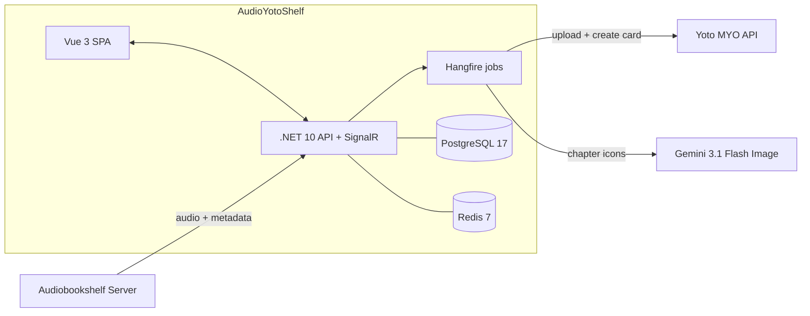
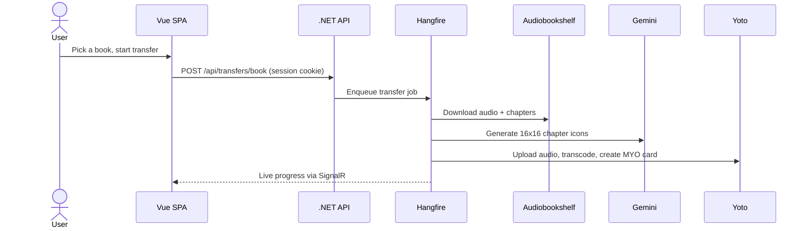

# AudioYotoShelf

[](https://github.com/O-Mutt/AudioYotoShelf/actions/workflows/ci.yml)
[](https://codecov.io/gh/O-Mutt/AudioYotoShelf)


[](#license)

Bridge your [Audiobookshelf](https://www.audiobookshelf.org/) library to [Yoto](https://www.yotoplay.com/) Make Your Own (MYO) cards.

Transfer audiobooks from your self-hosted Audiobookshelf server to Yoto MYO cards with auto-generated pixel art chapter icons, series-to-playlist mapping, and age range suggestions.

## Features

- **Library browsing** — Browse your ABS library with book/series views
- **One-click transfers** — Download from ABS, upload to Yoto, create card automatically
- **Chapter icon generation** — AI-generated 16×16 pixel art icons via Gemini, or use Yoto's public icon library
- **Age range suggestions** — Automatic age range inference from metadata with user override
- **Series support** — Transfer entire series as individual cards
- **Real-time progress** — SignalR-powered live transfer status updates
- **Background processing** — Hangfire job queue with dashboard
- **Per-user permissions** — Respects ABS library access controls
- **Secure sessions** — http-only cookie auth; every request is bound to your own connection
- **Admin analytics** — optional admin dashboard: users, logins/sessions, transfer success rate
- **Health & metrics** — liveness/readiness probes and Prometheus metrics for monitoring

## Architecture



### Transfer pipeline



## Tech Stack

| Layer | Technology |
|-------|-----------|
| Backend | .NET 10, C# 14, EF Core 10 |
| Frontend | Vue 3.5, TypeScript, Vite 7, Pinia 3, Tailwind CSS |
| Database | PostgreSQL 17 |
| Cache | Redis 7 |
| Jobs | Hangfire |
| Real-time | SignalR |
| Icons | Gemini 3.1 Flash Image + SixLabors.ImageSharp |
| Audio | FFmpeg (chapter extraction) |

> Exact versions are pinned in source so they stay verifiable: .NET target and C# language in [`Directory.Build.props`](Directory.Build.props), backend packages in [`Directory.Packages.props`](Directory.Packages.props), the SDK band in [`global.json`](global.json), Node in [`.nvmrc`](.nvmrc), and frontend packages in [`src/AudioYotoShelf.ClientApp/package.json`](src/AudioYotoShelf.ClientApp/package.json).

## Quick Start

### Prerequisites

- Docker and Docker Compose
- Yoto Developer API credentials (see below)
- (Optional) a Gemini API key for AI icon generation (see below)

Audiobookshelf needs no pre-provisioned token — you sign in with your normal ABS
username and password inside the app. The app stores the resulting token per user and issues an
http-only session cookie, so your identity is never carried in the URL or written to request logs.

### Getting your credentials

**Yoto (required)** — uses the OAuth Authorization Code flow:

1. Go to the [Yoto Developer Dashboard](https://developers.yotoplay.com) and sign in.
2. Create an application to get a **Client ID** and **Client Secret**.
3. Register the redirect/callback URL so it exactly matches your deployment:
   - Local Docker: `http://localhost:8080/api/auth/yoto/callback`
   - Production: `https://<your-domain>/api/auth/yoto/callback`
4. Put the Client ID/Secret in `.env` (`YOTO_CLIENT_ID`, `YOTO_CLIENT_SECRET`).

**Gemini (optional, for generated icons):**

1. Open [Google AI Studio → API keys](https://aistudio.google.com/apikey).
2. Click **Create API key**, copy it, and set `GEMINI_API_KEY` in `.env`.
3. Without a key, transfers still work — pick icons from Yoto's public library instead.

### Environment variables

Set in `.env` (copied from [`.env.example`](.env.example)). Used by [`docker-compose.yml`](docker-compose.yml):

| Variable | Required | Default | Description |
|----------|----------|---------|-------------|
| `YOTO_CLIENT_ID` | yes | — | Yoto OAuth app client ID |
| `YOTO_CLIENT_SECRET` | yes | — | Yoto OAuth app client secret |
| `GEMINI_API_KEY` | no | — | Google AI Studio key for icon generation |
| `DB_PASSWORD` | recommended | `changeme` | PostgreSQL password |
| `BRIDGE_PORT` | no | `8080` | Host port the app listens on |
| `AUDIOBOOKSHELF_URL` | recommended | — | The only ABS server users may connect to; hides the URL field on the setup screen. Checked at startup, and any connection stored against another server is repointed to it |
| `AUDIOBOOKSHELF_PUBLIC_URL` | for SSO, if `AUDIOBOOKSHELF_URL` is an internal name | — | The address browsers reach ABS at (for example `https://abs.example.com`). Audiobookshelf builds the identity provider's return address from the host it was called on, so an internal container name would send the browser somewhere it cannot go. Not needed when `AUDIOBOOKSHELF_URL` is already the public address |
| `ADMIN_AUDIOBOOKSHELF_URL` | no | — | Trusted ABS server URL that can grant admin (see [Admin analytics](#admin-analytics)) |
| `ADMIN_USERNAMES` | no | — | Comma-separated ABS usernames granted admin when they sign in via the trusted server |

### Setup

```bash
# Clone the repo
git clone https://github.com/O-Mutt/AudioYotoShelf.git
cd AudioYotoShelf

# Create environment file and fill in the values above
cp .env.example .env

# Build and run
docker compose up -d

# Open in browser
open http://localhost:8080
```

### First Run

1. Open `http://localhost:8080` and connect to Audiobookshelf. With `AUDIOBOOKSHELF_URL` set, the
   primary button is **Connect with single sign-on**: if you are already signed in to your identity
   provider it connects you with nothing to type, and you get exactly the library access and
   download permission you have in Audiobookshelf itself. See
   [Single sign-on](#single-sign-on-with-audiobookshelf) for the one setting it needs. Under
   **Use a different method** you can still use either of:
   - your username and password, or
   - an **API key** — needed if you sign in to ABS with single sign-on (OpenID Connect), since
     those accounts have no password. An ABS admin creates one under **Settings → API Keys**,
     choosing the user it acts as; it gets exactly that user's library access. The user needs
     the "can download" permission for transfers.

   Enter the server URL too, unless `AUDIOBOOKSHELF_URL` is set.
2. Authorize with Yoto — you're redirected to Yoto's login (OAuth authorization code flow) and back to the app
3. Browse your library and transfer books to MYO cards

## Single sign-on with Audiobookshelf

For an Audiobookshelf that signs people in through OpenID Connect (Authentik, Keycloak and so on).
The app drives Audiobookshelf's own sign-in for API clients, so it ends up holding the person's real
access and refresh tokens; nothing is typed and no API key changes hands.

**Set up (once):**

1. In Audiobookshelf go to **Settings → Authentication → Allowed Mobile Redirect URIs** and add
   `https://<this app's address>/api/auth/abs/sso/callback`, character for character. Do not use `*`:
   with a single `*` entry Audiobookshelf accepts any redirect address, so another site could start
   a flow that lands its code somewhere else.
2. Set `AUDIOBOOKSHELF_URL` (single sign-on is only offered when the server is fixed) and, if that is
   an internal name, `AUDIOBOOKSHELF_PUBLIC_URL` too.
3. If Audiobookshelf accounts already exist for your people, set **Match Existing By** to `email` in
   Audiobookshelf. Without it the first sign-in creates a second account with the same name and
   separate progress. Check whether Audiobookshelf **auto-registers** new accounts too: if it does,
   anyone who can reach this app can have an account created by clicking Connect, so restrict who
   can reach it.

**If it does not work:** a person who is sent back to the setup screen sees whether the sign-in
expired (start again) or single sign-on is unavailable, and can use an API key or password instead.
The most common cause of "unavailable" is the redirect address in step 1 not matching exactly.
Audiobookshelf answers 400 `No session` when its session cookie was lost between the two halves of
the flow, so check that first if every attempt fails.

## Admin analytics

An optional, read-only **admin dashboard** at `/admin` shows usage at a glance: total and active
users, logins/sessions over time, transfer counts and success rate, and a per-user table.

Admin access is deliberately strict: a user becomes admin **only** when their ABS username is in
`ADMIN_USERNAMES` **and** they sign in against the trusted server named in
`ADMIN_AUDIOBOOKSHELF_URL`. Requiring the trusted server stops anyone from pointing the app at a
look-alike ABS instance to claim an admin username. Leave `ADMIN_AUDIOBOOKSHELF_URL` unset to
disable admin promotion entirely.

```bash
# .env — grant yourself admin, then sign in against that ABS server
ADMIN_AUDIOBOOKSHELF_URL=https://abs.example.com
ADMIN_USERNAMES=alice,bob
```

The `IsAdmin` flag is persisted per user, so you can also grant or revoke it directly in the database.

## Monitoring & observability

| Endpoint | Purpose |
|----------|---------|
| `GET /health/live` | Liveness — the process is up (no dependency checks) |
| `GET /health/ready` | Readiness — PostgreSQL + Redis reachable (FFmpeg reported as degraded, not failing) |
| `GET /metrics` | Prometheus scrape: HTTP rate/latency/errors, outbound ABS/Yoto/Gemini calls, .NET runtime, and `ays.transfers.completed` / `ays.transfers.failed` counters |
| `GET /hangfire` | Hangfire background-job dashboard |

Logs are written to the console (structured, via Serilog); set `Serilog__SeqUrl` to also ship them
to a [Seq](https://datalust.co/seq) server.

> **Restrict `/metrics` and `/hangfire` at the network/proxy layer.** They expose operational data
> (not user data) and are intentionally unauthenticated so scrapers and operators can reach them.

## Development

### Prerequisites

- .NET SDK matching [`global.json`](global.json) / [`Directory.Build.props`](Directory.Build.props) (`net10.0`)
- Node.js per [`.nvmrc`](.nvmrc) — run `nvm use`
- PostgreSQL 17 and Redis 7 (or `docker compose up -d postgres redis`)

### Backend

```bash
cd src/AudioYotoShelf.Api
dotnet run
```

### Frontend

```bash
cd src/AudioYotoShelf.ClientApp
nvm use
npm install
npm run dev
```

The Vite dev server runs on port 5173 and proxies `/api` and `/hubs` to the .NET backend on port 5000.

### Tests, lint & format

These mirror the CI gates in [`.github/workflows/ci.yml`](.github/workflows/ci.yml):

```bash
# Backend
dotnet test
dotnet format AudioYotoShelf.sln --verify-no-changes   # check; drop the flag to auto-fix

# Frontend
cd src/AudioYotoShelf.ClientApp
npm run lint && npm run format:check && npm run type-check
```

See [CONTRIBUTING.md](CONTRIBUTING.md) for branch/commit conventions and the full PR workflow.

## Proxmox LXC Deployment

For Proxmox users running Docker inside an LXC container:

```bash
# On Proxmox host: enable nesting and keyctl
pct set <CTID> -features keyctl=1,nesting=1

# Inside LXC: install Docker
curl -fsSL https://get.docker.com | sh

# Deploy
cd /opt/audioyotoshelf
docker compose up -d
```

Recommended LXC resources: 4 cores, 4GB RAM, 60GB disk.

## Project Structure

```
AudioYotoShelf/
├── src/
│   ├── AudioYotoShelf.Api/          # ASP.NET Core API + SignalR hub
│   ├── AudioYotoShelf.Core/         # Domain entities, interfaces, DTOs
│   ├── AudioYotoShelf.Infrastructure/ # EF Core, API clients, services
│   └── AudioYotoShelf.ClientApp/    # Vue 3 SPA
├── tests/
├── Dockerfile
├── docker-compose.yml
└── AudioYotoShelf.sln
```

## Contributing

Contributions are welcome. Start with [CONTRIBUTING.md](CONTRIBUTING.md), and please
follow the [Code of Conduct](CODE_OF_CONDUCT.md). Found a security issue? See
[SECURITY.md](SECURITY.md) — report it privately, not as a public issue.

## License

[MIT](LICENSE) © Matt O'Keefe
